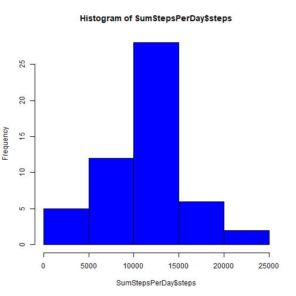

##About Document: Following code & text give the steps to approach to solve Reproducible Research: Peer Assignment1. This Assignment data is taken from personal movement using activity monitoring device.This device collects data at 5 minute intervals through out the day. The data consists of two months of data from an anonymous individual collected during the months of October and November, 2012 and include the number of steps taken in 5 minute intervals each day.


## Loading and preprocessing the data

```r
setwd("C:/Users/212470996/Desktop/dataset/RR")

if(!exists("activity"))
{ 
  FileUrl <- "https://d396qusza40orc.cloudfront.net/repdata%2Fdata%2Factivity.zip"
  download.file(FileUrl,destfile = "./activity.zip")
  unzip("./activity.zip")
  activity <- read.csv("./activity.csv",header = TRUE)
}
```


## What is mean total number of steps taken per day?

*  Solved this question using SumStepsPerDay. 
*  Below MeanOfTotalSteps chunck of code gives histogram of the total number of steps taken each day. 


```r
   SumStepsPerDay <- aggregate(steps~date,activity,sum, na.rm = TRUE)
   hist(SumStepsPerDay$steps, col = "blue")
```



Calculated mean and median of the total number of steps taken per day.


```r
   MeanSteps <- mean(SumStepsPerDay$steps)
   MeanSteps
```

```
## [1] 10766.19
```

```r
   MedianSteps <- median(SumStepsPerDay$steps)
   MedianSteps
```

```
## [1] 10765
```

## What is the average daily activity pattern?


```r
#Finding the mean of activity pattern 
MeanActivityPattern <- aggregate(steps~interval,activity,mean, na.rm = TRUE)

# Plot a graph for average daily activity pattern
plot(MeanActivityPattern$interval,MeanActivityPattern$steps, type ="l", xlab = "steps", ylab="ActivityInterval")
```


5-minute interval with maximum number of steps


```r
MaxSteps <- MeanActivityPattern[which.max(MeanActivityPattern$steps),] 
MaxSteps$interval
```

```
## [1] 835
```


## Imputing missing values


```r
#using is.na to find the missing values
missingsvalues <- is.na(activity$steps)
CountMissingValues <- nrow(activity[missingsvalues,])

# Fetch Mean for Steps Per Interval
getMeanStepsPerInterval<-function(interval){
MeanActivityPattern[MeanActivityPattern$interval==interval,]$steps
}

activityNoNA<-activity

#Substitute the missing values / NA values with Meanvalue in 5 min Interval
for(i in 1:nrow(activityNoNA)){
    if(is.na(activityNoNA[i,]$steps)){
        activityNoNA[i,]$steps <- getMeanStepsPerInterval(activityNoNA[i,]$interval)
    }
}

SumStepsPerDayNoNA <- aggregate(steps ~ date, data=activityNoNA, sum)

#plot a histogram of the daily total number of steps taken
hist(SumStepsPerDayNoNA$steps, col="green")
```


* Caluculate mean and median total number of steps taken per day


```r
MeanStepsPerDayNoNA <- mean(SumStepsPerDayNoNA$steps)
MeanStepsPerDayNoNA
```

```
## [1] 10766.19
```

```r
MedianStepsPerDayNoNA <- median(SumStepsPerDayNoNA$steps)
MedianStepsPerDayNoNA
```

```
## [1] 10766.19
```

## Are there differences in activity patterns between weekdays and weekends?


```r
library("lubridate")
# This function fetches if the given day falls under a weekday or weekend
weekend_weekday <- function(date)
{
day <- wday(as.Date(date),label = TRUE) 
if( day %in% c("Sun","Sat"))
return("weekend")
else if (day %in% c("Mon","Tue","Wed","Thu","Fri"))
return("weekday")
else stop("invalid date")
}

#Fine the Day for given Activity Date
activityNoNA$day <- lapply(activityNoNA$date,weekend_weekday)


stepsByDay <- aggregate(activityNoNA$steps ~ activityNoNA$interval + as.character(activityNoNA$day), activityNoNA, mean)

names(stepsByDay) <- c("interval", "day", "steps")

library("lattice")
xyplot(steps ~ interval | day, stepsByDay, type = "l", layout = c(1, 2), xlab = "Interval", ylab = "Steps")
```


